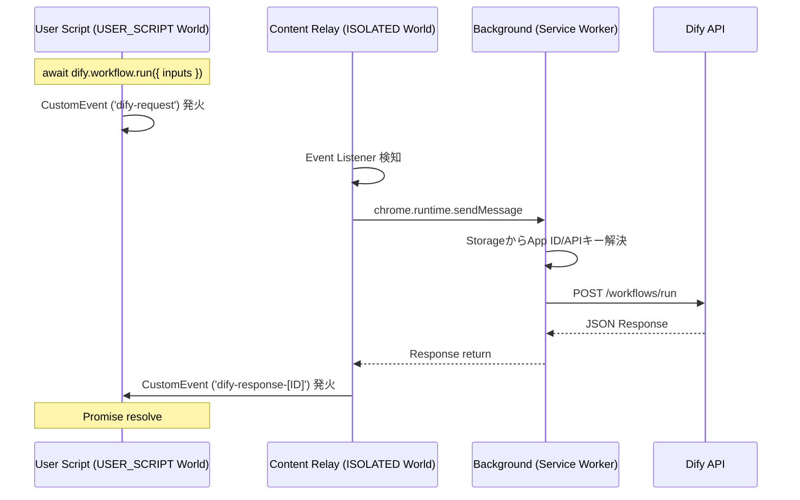
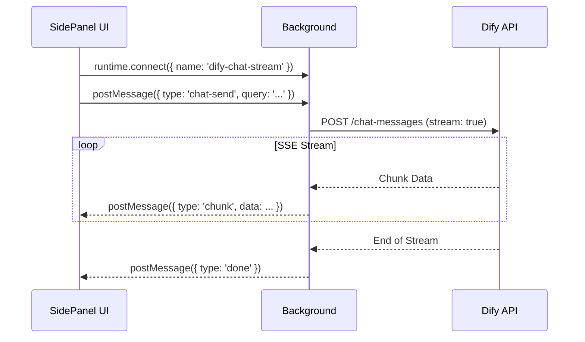

# Chrome拡張機能 設計書：Dify Monkey

## 1. 概要

本プロジェクトは、**「Difyと連携可能なユーザースクリプトマネージャー」**を開発するものである。

ユーザーは任意のWebページ上で独自のJavaScript（ユーザースクリプト）を実行でき、そのスクリプト内からDifyのワークフローを直接呼び出すことができる。また、サイドパネルにてDifyのエージェントとチャットを行う機能も提供する。

## 2. システムアーキテクチャ (Manifest V3)

`chrome.userScripts` APIを中心としたセキュアかつモダンな構成を採用する。

### 2.1 コンポーネント構成

1.  **Background Service Worker (`background.ts`)**
    
    -   拡張機能の中枢。
        
    -   ユーザースクリプトの登録・解除（`chrome.userScripts` API利用）。
        
    -   Dify APIへのHTTPリクエスト代行（CORS回避・APIキー隠蔽）。
        
    -   `chrome.storage` の変更監視とスクリプト同期。
        
2.  **Content Script (`content/relay.ts`)**
    
    -   実行ワールド：`ISOLATED`
        
    -   役割：`USER_SCRIPT` ワールドと `BACKGROUND` 間の通信ブリッジ。
        
    -   DOMイベント（CustomEvent）を検知し、Backgroundへメッセージを転送する。
        
3.  **User Scripts (Runtime)**
    
    -   実行ワールド：`USER_SCRIPT`
        
    -   ユーザーが記述したコードが動作する空間。ページ本来のJS（MAINワールド）とは分離される。
        
    -   システムが自動的に **Dify Bridge（通信用関数）** をヘッダーとして付与して実行する。
        
4.  **UI Components**
    
    -   **Side Panel:** Difyチャットインターフェース。
        
    -   **Options Page:** スクリプトエディタ（Monaco Editor）およびDify接続設定。
        

### 2.2 データフロー（Dify実行時）



### 2.3 チャットストリーミングフロー

チャットのレスポンスはストリーミング（SSE）で行われるため、`Port` を使用した長寿命接続を採用する。



## 3. 技術スタック

| カテゴリ | 選定技術 | 備考 |
| --- | --- | --- |
| Build Tool | Vite + CRXJS | 高速ビルド、HMR、Manifest自動生成 |
| Core | React + TypeScript | コンポーネント指向、型安全性 |
| Styling | Tailwind CSS | ユーティリティファーストCSS |
| UI Library | shadcn/ui | Difyライクなモダンデザイン、Radix UIベース |
| Icons | Lucide React | 簡单で統一感のあるアイコン |
| Editor | @monaco-editor/react | VS Code同等のコード編集体験（補完機能） |
| Package Mgr | npm | パッケージ管理ツール |
| Router | React Router DOM | Options Page内の画面遷移（SPAライクな動作） |
| Markdown | react-markdown + remark-gfm | チャットメッセージのレンダリング（テーブル、コードブロック対応） |

## 4. 機能要件

### 4.1 ユーザースクリプト管理 (Options Page)

-   **スクリプト一覧:** 登録済みスクリプトの表示、ON/OFF切り替え、削除。
    
-   **スクリプトエディタ:**
    
    -   Monaco Editorを使用。
        
    -   TypeScript/JavaScriptのシンタックスハイライト。
        
    -   `dify` オブジェクトの型定義（d.ts）を読み込ませ、入力補完を効かせる。
        
-   **メタデータ設定:**
    -   対象URLパターン（ワイルドカードまたは正規表現）。
    -   スクリプト名。
        

### 4.2 Dify連携設定 (Options Page)

-   **接続情報保存 (Apps):**
    
    -   複数のDifyアプリ設定を管理可能にする。
    
    -   各アプリ設定:
        -   App Name (識別用)
        -   API Key
        -   App ID (UUID, 自動生成)
        
    -   **Base URL:** 共通設定として保持（またはアプリごとの上書きも考慮、基本は共通で可）。
        
-   **保存先:** `chrome.storage.local`（ブラウザ同期はさせず、ローカルに留める）。
    

### 4.3 Dify実行ブリッジ (User Script API)

ユーザースクリプト内で以下のグローバルオブジェクトを利用可能にする。

```TypeScript
// 型定義イメージ
interface DifyInterface {
  workflow: {
    /**
     * ワークフローを実行し、結果を待機する。
     * @param inputs ワークフローへの入力パラメータ
     * @param options オプション (特定のAppIDを指定する場合など)
     */
    run: (inputs: Record<string, any>, options?: { appId?: string }) => Promise<WorkflowResult>;
  };
  // ⚠️ 未実装: chat APIはUser Script Bridgeでは未実装
  // サイドパネルのChat UIでのみチャット機能を利用可能
  // chat: {
  //   send: (query: string) => Promise<ChatResult>;
  // };
  storage: {
    /** スクリプト固有のデータを保存する (chrome.storage互換) */
    set: (key: string, value: any) => Promise<void>;
    get: (key: string) => Promise<any>;
  };
  ui: {
    /** 画面右下にトースト通知を表示する */
    toast: (message: string, type?: 'success' | 'error' | 'info') => void;
    /** ユーザー入力を求めるダイアログを表示する */
    prompt: (message: string) => Promise<string | null>;
  };
  page: {
    /** Readabilityでページのメインコンテンツを抽出する */
    readContent: () => Promise<{ title: string; content: string; length: number }>;
    /** 現在のページURLを取得 */
    getUrl: () => string;
    /** 現在のページタイトルを取得 */
    getTitle: () => string;
    /** ユーザーが選択中のテキストを取得 */
    getSelection: () => string;
  };
  file: {
    /** ファイルをDifyにアップロードする (Blob/File/Base64) */
    upload: (data: Blob | File | string, filename: string, mimeType?: string) => Promise<UploadedFile>;
  };
  /** サイドパネルのLogsセクションにメッセージを出力する */
  log: (message: string, data?: any) => void;
  
  // Lifecycle APIs (サイドパネル実行時は自動的に呼ばれる)
  /** スクリプト実行開始を通知する */
  start: () => void;
  /** スクリプト実行完了を通知する */
  done: (result?: { success: boolean; error?: string }) => void;
  /** 停止ボタンが押された時のコールバックを登録する */
  onAbort: (callback: () => void) => void;
  /** スクリプトが中断されたかどうかを確認する */
  isAborted: () => boolean;
  /** 内部フラグ: 中断状態 */
  _aborted: boolean;
}
declare const dify: DifyInterface;

```

### 4.4 サイドパネル (Chat UI)

-   ブラウザのサイドパネルで動作。
    
-   設定されたAPIキーを用いてDifyのチャットAPI（`/chat-messages`）と通信。
    
-   **タブ構成:** Chat / Scripts の2タブでモード切り替え。

-   **ページコンテンツ読み込み機能:**
    -   「ページを読み込む」ボタンでReadabilityを使用してメインコンテンツを抽出。
    -   抽出したコンテンツは添付チップとして表示され、編集モーダルで確認・編集可能。
    -   メッセージ送信時にページコンテンツを自動的に含める。

-   **デザイン:** Dify公式のチャット画面を模倣（白/グレー基調、角丸、送信ボタンなど）。
    
-   **ダークモード:** `prefers-color-scheme` に追従して自動切り替え。

### 4.5 サイドパネル (Scripts 実行UI)

-   **スクリプト一覧:** 登録済みスクリプトをカード形式で表示。有効/無効ステータスとワンクリック実行ボタン付き。

-   **リアルタイム進捗表示:** 実行中のスクリプトはプログレスバーとステップ情報で状態を表示。

-   **並列実行サポート:** 複数スクリプトの同時実行が可能。実行中のスクリプト数をバッジで表示。

-   **実行履歴:** 完了した実行の結果を確認、コピー、再実行が可能。
    

## 5. データ構造設計

### chrome.storage.local

```TypeScript
// セキュリティモード
enum SecurityMode {
  DEVICE_KEY = 'device_key',          // デフォルト: デバイスキーで自動暗号化
  MASTER_PASSWORD = 'master_password', // マスターパスワードで暗号化
  PLAINTEXT = 'plaintext'             // 平文保存（非推奨）
}

// 暗号化されたAPIキー構造
interface EncryptedApiKey {
  mode: SecurityMode;
  encrypted: string;  // Base64エンコードされた暗号化データ
  salt?: string;      // Base64エンコードされたソルト（マスターパスワードモードのみ）
  iv: string;         // Base64エンコードされたIV
  version: 1;         // 暗号化バージョン
}

interface StorageSchema {
  // 設定関連
  settings: {
    difyBaseUrl: string;           // 共通Base URL (例: https://api.dify.ai/v1)
    theme: 'system' | 'light' | 'dark';
    securityMode: SecurityMode;    // 現在のセキュリティモード
    sessionTimeout?: number;       // セッションタイムアウト（分、マスターパスワードモードのみ）
    welcomeShown?: boolean;        // ウェルカムダイアログ表示済みフラグ
    devMode?: boolean;             // 開発者モード（詳細ログ有効化）
    masterPasswordHash?: string;   // マスターパスワードハッシュ（検証用）
    masterPasswordSalt?: string;   // マスターパスワードソルト
  };
  
  // Difyアプリ設定リスト
  difyApps: {
    [id: string]: {
      id: string;                           // 内部管理用UUID
      name: string;                         // 表示名 (例: "翻訳Bot", "要約くん")
      apiKey: EncryptedApiKey | string;     // 暗号化または平文のAPIキー（後方互換性）
      appType: 'workflow' | 'chatflow';     // アプリタイプ
      createdAt: number;
    };
  };

  // スクリプトデータ (IDをキーにしたMap形式推奨)
  scripts: {
    [id: string]: {
      id: string;
      name: string;
      code: string;       // ユーザーが書いたコード
      matches: string[];  // 対象URLパターン
      
      // 実行設定
      runAt: 'document_start' | 'document_end' | 'document_idle'; // デフォルト: document_idle
      trigger: 'auto' | 'context_menu'; // auto: 自動実行, context_menu: 右クリックメニュー
      linkedAppId?: string; // このスクリプトがデフォルトで使用するDifyアプリID
      
      enabled: boolean;
      updatedAt: number;
    };
  };
  
  // サイドパネルの最後に選択されたタブ
  sidepanelLastTab?: 'chat' | 'scripts';
}

```

## 6. ディレクトリ構造

```Plaintext
root/
├── manifest.json           # Chrome拡張マニフェスト (Manifest V3)
├── package.json
├── vite.config.ts
├── tailwind.config.js
├── src/
│   ├── background/
│   │   └── index.ts        # Service Worker
│   ├── content/
│   │   └── relay.ts        # Content Script
│   ├── sidepanel/
│   │   ├── index.html
│   │   ├── index.tsx
│   │   ├── App.tsx         # Main (Tab Router)
│   │   └── components/     # Side Panel Components
│   │       ├── TabNav.tsx          # Chat/Scripts タブ切り替え
│   │       ├── ScriptCard.tsx      # スクリプトカード
│   │       ├── ScriptLogs.tsx      # ログ表示
│   │       ├── ExecutionProgress.tsx  # 進捗表示
│   │       ├── ExecutionHistory.tsx   # 実行履歴
│   │       ├── ContentEditModal.tsx   # ページコンテンツ編集モーダル
│   │       └── ScriptsTab.tsx      # Scriptsタブ統合
│   ├── options/
│   │   ├── index.html
│   │   ├── index.tsx
│   │   ├── App.tsx         # Router Provider
│   │   ├── pages/          # Page Components
│   │   │   ├── ScriptList.tsx
│   │   │   ├── ScriptEditor.tsx
│   │   │   ├── ScriptTemplates.tsx
│   │   │   ├── DifyApps.tsx
│   │   │   ├── AppSettings.tsx
│   │   │   ├── ApiReference.tsx    # API リファレンス
│   │   │   ├── PrivacyPolicy.tsx   # プライバシーポリシー
│   │   │   └── QuickStart.tsx      # クイックスタートガイド
│   │   └── components/
│   │       └── Sidebar.tsx         # サイドバーナビゲーション
│   ├── prompt/             # プロンプトダイアログ用ポップアップ
│   │   ├── index.html
│   │   ├── main.tsx
│   │   └── App.tsx
│   ├── shared/             # 共通モジュール
│   │   ├── api/
│   │   │   └── dify-client.ts      # Dify API Client
│   │   ├── components/             # 共通UIコンポーネント
│   │   │   ├── MasterPasswordDialog.tsx
│   │   │   ├── SecurityModeSelector.tsx
│   │   │   └── WelcomeDialog.tsx
│   │   ├── hooks/          # useDifySettings, useDifyApps, useUserScripts, useScriptExecution, useTheme
│   │   ├── lib/
│   │   │   ├── storage.ts          # chrome.storage ラッパー
│   │   │   ├── bridge.ts           # User Script Bridge 生成
│   │   │   ├── crypto-helper.ts    # 暗号化ヘルパー
│   │   │   ├── api-key-helper.ts   # APIキー管理
│   │   │   ├── device-key-manager.ts  # デバイスキー管理
│   │   │   └── error-handler.ts    # エラーハンドリング
│   │   ├── types/
│   │   │   └── index.ts            # 共通型定義
│   │   └── __tests__/              # テストファイル
│   └── types/
│       └── dify.d.ts       # Monaco Editor用型定義

```

## 7. セキュリティ・制約事項

1.  **APIキーの保護:**
    
    -   APIキーは `chrome.storage.local` にのみ保存し、絶対にDOM（ページ側）には露出させない。
        
    -   通信はすべてBackground Script内で行う。
        
2.  **スクリプトの隔離:**
    
    -   `chrome.userScripts` を使用し、`world: 'USER_SCRIPT'` で実行することで、ページ側のJavaScript変数を汚染しない。
        
    -   ただしDOM操作は可能とする。
        
3.  **権限:**
    
    -   `host_permissions: ["<all_urls>"]` が必要（任意のサイトで動かすため）。
        
    -   `userScripts` 権限が必要（開発者モードONが必要な場合あり）。

## 8. 将来の拡張性 (Roadmap)

1.  **外部ライブラリのサポート:**
    -   `@require` のような仕組みで、jQuery, Lodash, Cheerioなどの外部ライブラリをスクリプト内で利用可能にする。
    
2.  **キーボードショートカット起動:**
    -   特定のキー入力でスクリプトを実行するトリガー種別の追加。

3.  **スクリプトの共有機能:**
    -   Gistや外部URLからのスクリプトインポート機能。

4.  **サイドパネルスクリプト実行の強化:**
    -   フルサンドボックス実行環境（現在は簡易パース）。
    -   タブのURL自動マッチハイライト。
    -   完了時のブラウザ通知。

5.  **汎用的なUI APIの拡張:**
    -   **`dify.ui.prompt` の拡張:**
        -   複数行入力（textarea）のサポート
        -   選択肢（select）のサポート - 配列またはオブジェクト形式
        -   数値入力（number）のサポート - min/max/step指定可能
        -   確認ダイアログ（confirm）のサポート - true/false返却
        -   第2引数でオプション指定: `{ type, placeholder, defaultValue, choices, rows, min, max, step }`
        -   後方互換性を維持しつつ、柔軟な入力UIを提供
    -   **`dify.ui.form` の追加（将来的）:**
        -   複数フィールドを含む複雑なフォームUIのサポート
        -   フィールド単位での詳細設定（必須項目、バリデーション等）
        -   オブジェクト形式での結果返却

6.  **チャット機能の強化（重要）:**
    -   **会話ID（conversation_id）の管理:**
        -   現状: チャット送信時に`conversationId`を渡していないため、毎回新しい会話として扱われる
        -   対応予定:
            -   Dify APIからのレスポンスに含まれる`conversation_id`を保持
            -   同一アプリ内での会話継続をサポート
            -   会話履歴のリセット機能（新しい会話を開始）
            -   アプリ切り替え時の会話IDクリア
        -   優先度: 高（チャット機能の基本的なUXに影響）
    -   **User Script Bridge への chat API 追加（将来的）:**
        -   `dify.chat.send()` のブリッジ実装
        -   ストリーミングレスポンスのコールバック対応

## 9. 画面構成 (UI Design)

### 9.1 Options Page (管理画面)

ユーザーがスクリプト管理や設定を行うメイン画面。サイドバーを備えた2ペイン構成を採用する。

1.  **Sidebar Menu**
    -   **My Scripts:** 作成済みスクリプトの一覧。
    -   **Templates:** コピペで使えるスクリプトテンプレート集。
    -   **Dify Apps:** 連携するDifyアプリケーションの設定。
    -   **Settings:** 拡張機能全体の設定（テーマ、インポート/エクスポートなど）。

2.  **Scripts View (List)**
    -   スクリプトをカードまたはリスト形式で表示。
    -   各カードに「有効/無効トグル」「編集ボタン」「削除ボタン」を配置。
    -   「+ Create New Script」ボタンで新規作成。

3.  **Script Editor View**
    -   **Metadata Header:**
        -   Script Name
        -   Target URL Patterns (複数行入力 or タグ入力)
        -   **Linked App:** ドロップダウンで登録済みDifyアプリを選択（紐付け）。
        -   **Trigger:** Auto / Context Menu の選択。
    -   **Code Editor:** Monaco Editorを使用（全画面に近い領域を確保）。
    -   **Footer:** Save (Ctrl+S), Cancel。

4.  **Templates View**
    -   スクリプトテンプレートをカード形式で表示。
    -   各テンプレートにタイトル、説明、プレビューコード、「Copy」「Use Template」ボタンを配置。
    -   「Use Template」でスクリプトエディタに遷移し、テンプレートコードが初期値としてセットされる。

5.  **Apps Management View**
    -   登録済みDifyアプリのリスト表示（アイコン、アプリ名、マスクされたAPI Keyの一部）。
    -   「+ Add App」ボタンでモーダルを開き、Name / API Key / Base URL を入力して追加。

### 9.2 Side Panel (チャットUI)

ブラウザのサイドパネルで動作するチャットインターフェース。

1.  **Header Area**
    -   **App Selector:** 現在会話するDifyアプリを切り替えるドロップダウン。
    -   **Menu Button:** 会話履歴のクリア、管理画面へのリンク、デバッグログ表示など。

2.  **Chat Area**
    -   メッセージタイムライン。
    -   **Thinking:** Difyからのストリーミングレスポンスをリアルタイム表示。
    -   Markdownレンダリング（コードブロック、テーブル対応）。

3.  **Input Area**
    -   自動リサイズ対応のテキストエリア。
    -   送信ボタン。
    -   (Future) ファイルアップロードボタン、音声入力ボタン。

### 9.3 Side Panel - Scripts タブ

1.  **実行中セクション**
    -   実行中のスクリプトをプログレスバーとステップ情報付きで表示。
    -   キャンセルボタンで実行中断可能。

2.  **スクリプト一覧**
    -   登録済みスクリプトをカード形式で表示。
    -   有効/無効ステータス、ワンクリック実行ボタン付き。

3.  **Logsセクション**
    -   `dify.log()` APIで出力されたメッセージを表示。
    -   タイムスタンプ、メッセージ、展開可能なJSONデータを表示。
    -   最大50件まで保持。

4.  **実行履歴セクション**
    -   最近10件の実行結果を表示。
    -   成功/失敗ステータス、実行時間、結果コピー、再実行ボタン。

## 10. 既知の問題・修正案

### 10.1 CSP/Trusted Types問題

**問題:** GitHubなど厳格なセキュリティポリシー（CSP、Trusted Types）を持つサイトで、コンテキストメニューやサイドパネルからのスクリプト実行がブロックされる。

**エラーメッセージ例:**
1. `This document requires 'TrustedScript' assignment. The action has been blocked.`
2. `Executing inline script violates the following Content Security Policy directive 'script-src ...'`

**原因:**
- 現在、コンテキストメニュー/サイドパネル実行時は `chrome.scripting.executeScript` でMAIN worldに対して `script.textContent = code` でインラインスクリプトを挿入している (`background/index.ts` 186行目、653行目付近)
- MAIN worldはページのCSP制約を受けるため、インラインスクリプト挿入がブロックされる

**修正案:**
- `chrome.userScripts.execute()` を使用して USER_SCRIPT worldでスクリプトを実行する
- USER_SCRIPT worldはページのCSP制約を受けないため、問題を回避できる
- 既存の自動実行スクリプト（`chrome.userScripts.register`）はUSER_SCRIPT worldで動作しているため影響なし

**変更箇所:**
- `background/index.ts`: 186-197行目（コンテキストメニュー実行）
- `background/index.ts`: 653-663行目（サイドパネル実行）

**参考:**
- https://developer.chrome.com/docs/extensions/reference/api/userScripts
