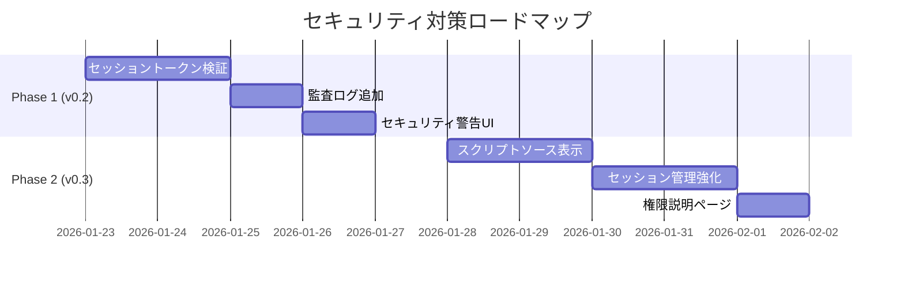

# セキュリティ監査レポート: dify-monkey Chrome拡張機能

**監査日**: 2026年1月22日  
**バージョン**: 0.1.0  
**監査者**: GitHub Copilot

---

## 概要

この文書は、dify-monkey Chrome拡張機能のセキュリティリスク分析結果をまとめたものです。

---

## ✅ 良好なセキュリティ対策

### 1. 暗号化の実装

| 項目 | 実装内容 |
|------|----------|
| 暗号化アルゴリズム | AES-256-GCM |
| 鍵導出関数 | PBKDF2 (100,000回イテレーション) |
| IV (初期化ベクトル) | 12バイト、ランダム生成 |
| ソルト | 16バイト、ランダム生成 |

**関連ファイル**: `src/shared/lib/crypto-helper.ts`

```typescript
const PBKDF2_ITERATIONS = 100000;  // High iteration count for security
const SALT_LENGTH = 16;
const IV_LENGTH = 12;
```

### 2. 3つのセキュリティモード

| モード | 説明 | 推奨度 |
|--------|------|--------|
| `DEVICE_KEY` | デバイス固有キーによる自動暗号化 | ✅ 推奨（デフォルト） |
| `MASTER_PASSWORD` | マスターパスワードによる暗号化 | ✅ 推奨 |
| `PLAINTEXT` | 平文保存 | ⚠️ 非推奨 |

### 3. Manifest V3使用

最新のChrome拡張機能マニフェストバージョンを使用しており、セキュリティが強化されています。

### 4. パスワード強度検証

- 最小8文字
- 大文字、小文字、数字、特殊文字の組み合わせをチェック
- 強度スコア（0-100）を算出

---

## ⚠️ 中程度のリスク

### 1. `<all_urls>` ホスト権限

**ファイル**: `manifest.json`

```json
"host_permissions": ["<all_urls>"]
```

**リスク**: すべてのウェブサイトにアクセス可能

**推奨対策**:
- 必要なドメインのみに制限することを検討
- ユーザーに権限の必要性を明示するUIを追加

---

### 2. ユーザースクリプトのコード実行

**ファイル**: `src/background/index.ts`

```typescript
await chrome.scripting.executeScript({
  func: (code: string) => {
    const scriptEl = document.createElement('script');
    scriptEl.textContent = code;
    document.documentElement.appendChild(scriptEl);
    scriptEl.remove();
  },
  world: 'MAIN',
});
```

**リスク**: 
- ユーザースクリプトはMAINワールドで実行
- ページのJavaScriptコンテキストにフルアクセス
- 悪意のあるスクリプトがインポートされた場合、ページ上の機密データにアクセス可能

**推奨対策**:
- スクリプトソースの検証機能を追加
- 新規スクリプト追加時にセキュリティ警告を表示

---

### 3. CSP (Content Security Policy) 設定

**ファイル**: `src/background/index.ts`

```typescript
csp: "script-src 'self' 'unsafe-inline' 'unsafe-eval';",
```

**リスク**: `unsafe-eval`と`unsafe-inline`はXSS攻撃のリスクを高める

**注記**: ユーザースクリプト機能の性質上、ある程度必要な設定

---

### 4. localStorageの使用

**ファイル**: `src/shared/lib/bridge.ts`

```typescript
storage: {
  set: async function(key, value) {
    localStorage.setItem(STORAGE_PREFIX + key, JSON.stringify(value));
  },
  get: async function(key) {
    const item = localStorage.getItem(STORAGE_PREFIX + key);
    return item ? JSON.parse(item) : undefined;
  }
}
```

**リスク**: スクリプト固有のストレージがlocalStorageに保存され、同一オリジンのスクリプトからアクセス可能

**推奨対策**: 機密データの場合は暗号化を検討

---

## 🔴 高リスク項目

### 1. APIキーがメモリに平文で存在

**説明**: 
- `getPlaintextApiKey()` で復号されたAPIキーは、API呼び出し時にメモリ上に平文で存在
- バックグラウンドサービスワーカーからの呼び出し時にも同様

**影響**: メモリダンプやデバッガー接続時にAPIキーが漏洩する可能性

**推奨対策**: 
- 使用後の変数クリアは JavaScript の性質上困難
- リスクとして認識しておく

---

### 2. デバイスキーのエクスポート可能性

**ファイル**: `src/shared/lib/device-key-manager.ts`

```typescript
key = await crypto.subtle.generateKey(
  { name: 'AES-GCM', length: 256 },
  true,  // extractable (needed to save to IndexedDB)
  ['encrypt', 'decrypt']
);
```

**リスク**: 
- `extractable: true` により、悪意のある拡張機能やコードがキーを抽出可能
- IndexedDBへの保存のため必要な設定

**推奨対策**: 
- IndexedDBアクセスを制限する追加対策を検討
- 拡張機能のオリジン分離を活用

---

### 3. Content ScriptからのCustomEvent通信

**ファイル**: `src/content/relay.ts`

```typescript
window.addEventListener('dify-request', async (event: Event) => {
  const customEvent = event as CustomEvent;
  const { requestId, type, payload } = customEvent.detail;
  // ...
});
```

**リスク**: 
- `window.dispatchEvent` を使用したメッセージングは、ページ上の悪意のあるスクリプトからも発信可能
- なりすましメッセージによる不正なAPI呼び出しの可能性

**推奨対策**:
- メッセージの発信元を検証する仕組みを追加
- ランダムなセッショントークンを使用

---

## 📋 改善提案サマリー

| 優先度 | 項目 | 対策 | 工数目安 |
|--------|------|------|----------|
| 🔴 高 | CustomEvent検証 | メッセージングにセッショントークンを追加し、偽装を防止 | 中 |
| 🔴 高 | スクリプト実行警告 | 新しいスクリプト追加時にセキュリティ警告を表示 | 小 |
| 🟡 中 | ホスト権限の説明 | オプションページで権限の必要性を説明 | 小 |
| 🟡 中 | APIキー有効期限 | セッションタイムアウト後のAPIキーキャッシュクリア | 中 |
| 🟢 低 | CSP強化 | 可能であれば`unsafe-eval`を避ける代替実装を検討 | 大 |

---

## 📊 総合評価

### スコア: **B+ (良好)**

この拡張機能は**基本的なセキュリティ対策が適切に実装**されています。

**強み**:
- 業界標準に従った暗号化実装
- 複数のセキュリティモード提供
- Manifest V3の採用

**改善が必要な点**:
- CustomEventメッセージングの検証
- ユーザーへのセキュリティリスク説明

**ユーザーへの注意事項**:
- 信頼できるスクリプトのみを使用すること
- マスターパスワードモードの使用を推奨
- 機密性の高いページではスクリプトを無効化することを検討

---

---

## 🎯 現実的なセキュリティ対策提案

### 拡張機能の目的を踏まえた分析

この拡張機能は「**Difyと連携可能なユーザースクリプトマネージャー**」であり、以下の特性を持ちます：

| 特性 | セキュリティへの影響 |
|------|---------------------|
| 任意のWebページでスクリプト実行 | `<all_urls>` 権限は**必須** |
| ユーザー自身がコードを記述 | 悪意のあるコードは**ユーザー責任** |
| DifyワークフローのAPI呼び出し | APIキー保護が**最重要** |
| 開発者・パワーユーザー向けツール | 過度な制限は**利便性を損なう** |

### 対策の優先度マトリクス

```
                    高い効果
                       ↑
    ┌─────────────────┼─────────────────┐
    │ [優先度1]       │ [優先度2]       │
    │ ・セッショントー│ ・スクリプト署名│
    │   クン検証      │   (将来検討)    │
    │ ・APIキー漏洩   │                 │
    │   防止ログ      │                 │
低い├─────────────────┼─────────────────┤高い
工数 │                 │                 │工数
    │ [優先度3]       │ [優先度4]       │
    │ ・警告表示      │ ・完全サンドボッ│
    │ ・ドキュメント  │   クス化        │
    │   整備          │ (過剰対策)      │
    └─────────────────┼─────────────────┘
                       ↓
                    低い効果
```

---

### 優先度1: 高効果・低工数 🔥 **今すぐ実装すべき**

#### 1-1. CustomEvent通信のセッショントークン検証

**問題**: 悪意のあるページスクリプトが `dify-request` イベントを偽装可能

**対策**: ページロード時にランダムなセッショントークンを生成し、通信時に検証

**実装案**:

```typescript
// bridge.ts - トークン生成
const SESSION_TOKEN = crypto.randomUUID();

function sendRequest(type, payload) {
  window.dispatchEvent(new CustomEvent('dify-request', {
    detail: {
      requestId: generateRequestId(),
      sessionToken: SESSION_TOKEN,  // 追加
      type: type,
      payload: payload
    }
  }));
}
```

```typescript
// relay.ts - トークン検証
let validSessionToken: string | null = null;

window.addEventListener('dify-request', async (event: Event) => {
  const { sessionToken, type, payload } = (event as CustomEvent).detail;
  
  // 最初のリクエストでトークンを記録、以降は検証
  if (!validSessionToken) {
    validSessionToken = sessionToken;
  } else if (sessionToken !== validSessionToken) {
    console.warn('[Dify Monkey] Invalid session token, ignoring request');
    return;
  }
  // ... 既存の処理
});
```

**工数**: 約2時間  
**効果**: メッセージ偽装攻撃を防止

---

#### 1-2. APIキー使用時の簡易監査ログ

**問題**: APIキーがどこで使われたか追跡困難

**対策**: APIキー復号時にログを記録（開発者モード時のみ）

**実装案**:

```typescript
// api-key-helper.ts
export async function getPlaintextApiKey(
  apiKey: EncryptedApiKey | string,
  password?: string
): Promise<string> {
  const settings = await storage.get('settings');
  
  if (settings?.devMode) {
    console.log('[Dify Monkey Audit] API key decrypted', {
      timestamp: new Date().toISOString(),
      caller: new Error().stack?.split('\n')[2]?.trim(),
      keyType: typeof apiKey === 'string' ? 'plaintext' : apiKey.mode
    });
  }
  
  // ... 既存の処理
}
```

**工数**: 約1時間  
**効果**: デバッグ時のAPIキー使用追跡が容易に

---

### 優先度2: 高効果・中工数 📌 **次のリリースで実装**

#### 2-1. 信頼できるスクリプトソースの表示

**問題**: どのスクリプトが安全か判断困難

**対策**: スクリプトのソース情報を保存・表示

**実装案**:

```typescript
// types/index.ts に追加
interface UserScript {
  // ... 既存のフィールド
  source?: {
    type: 'manual' | 'template' | 'import';
    url?: string;        // インポート元URL
    importedAt?: number; // インポート日時
  };
}
```

**UI変更**:
- スクリプト一覧で「📝手動作成」「📋テンプレート」「🔗インポート」のバッジ表示
- インポートスクリプトには元URLを表示

**工数**: 約4時間  
**効果**: ユーザーがスクリプトの出所を判断可能

---

#### 2-2. マスターパスワードのセッション管理強化

**問題**: セッションタイムアウト後もメモリにパスワードが残る可能性

**対策**: 明示的なセッションクリア機能

**実装案**:

```typescript
// crypto-helper.ts に追加
class SessionManager {
  private static passwordCache: string | null = null;
  private static timeoutId: ReturnType<typeof setTimeout> | null = null;

  static setPassword(password: string, timeoutMinutes: number) {
    this.clearSession();
    this.passwordCache = password;
    this.timeoutId = setTimeout(() => {
      this.clearSession();
      // sidepanelに通知
      chrome.runtime.sendMessage({ type: 'session-expired' });
    }, timeoutMinutes * 60 * 1000);
  }

  static getPassword(): string | null {
    return this.passwordCache;
  }

  static clearSession() {
    this.passwordCache = null;
    if (this.timeoutId) {
      clearTimeout(this.timeoutId);
      this.timeoutId = null;
    }
  }
}
```

**工数**: 約3時間  
**効果**: パスワード露出時間を最小化

---

### 優先度3: 中効果・低工数 📝 **ドキュメント・UI改善**

#### 3-1. セキュリティ警告の表示

**対象箇所**:
- 新規スクリプト追加時
- 外部URLからのインポート時（将来機能）
- PLAINTEXTモード選択時

**実装案**:

```tsx
// components/SecurityWarning.tsx
export function SecurityWarning({ type }: { type: 'script' | 'plaintext' }) {
  const messages = {
    script: '⚠️ スクリプトはページ上のすべてのデータにアクセスできます。信頼できるコードのみを実行してください。',
    plaintext: '⚠️ PLAINTEXTモードではAPIキーが暗号化されません。DEVICE_KEYまたはMASTER_PASSWORDモードを推奨します。'
  };
  
  return (
    <div className="bg-yellow-50 dark:bg-yellow-900/20 border border-yellow-200 dark:border-yellow-800 rounded-lg p-3 text-sm">
      {messages[type]}
    </div>
  );
}
```

**工数**: 約2時間  
**効果**: ユーザーのセキュリティ意識向上

---

#### 3-2. 権限説明ページの追加

**対象**: オプションページのSettingsセクション

**内容**:
```markdown
## この拡張機能が必要とする権限

### すべてのウェブサイトへのアクセス
ユーザースクリプトを任意のサイトで実行するために必要です。
拡張機能はあなたが登録したスクリプトのみを実行し、
データを外部に送信することはありません（Dify APIへの明示的な呼び出しを除く）。

### ストレージ
スクリプト、設定、APIキーを保存するために使用します。
APIキーは暗号化されて保存されます。
```

**工数**: 約1時間  
**効果**: ユーザーの不安軽減

---

### 優先度4: 過剰対策（実装非推奨）

以下は**利便性を著しく損なう**ため、現時点では非推奨：

| 対策 | 非推奨の理由 |
|------|-------------|
| スクリプトの完全サンドボックス化 | DOM操作が制限され、ユーザースクリプトの価値が半減 |
| ホスト権限の動的要求 | UXが煩雑になり、毎回許可が必要に |
| スクリプトの署名検証 | 個人利用では署名者が本人、信頼性に寄与しない |
| APIキーのサーバーサイド管理 | セルフホスト前提、複雑さが増大 |

---

### 実装ロードマップ



---

### まとめ: バランスの取れたセキュリティ方針

```
┌────────────────────────────────────────────────────────────┐
│                    セキュリティ方針                         │
├────────────────────────────────────────────────────────────┤
│ 1. ユーザーの自己責任を前提としつつ、リスクを明示する      │
│ 2. APIキー保護を最優先とし、暗号化をデフォルトに          │
│ 3. 技術的対策は費用対効果を重視し、過剰対策を避ける       │
│ 4. 開発者モードで詳細なログを提供し、問題追跡を容易に     │
└────────────────────────────────────────────────────────────┘
```

---

## 変更履歴

| 日付 | バージョン | 変更内容 |
|------|------------|----------|
| 2026-01-22 | 1.0 | 初回監査実施 |
| 2026-01-22 | 1.1 | 現実的な対策提案を追加 |

---

## 参考資料

- [Chrome Extension Security Best Practices](https://developer.chrome.com/docs/extensions/mv3/security/)
- [Web Crypto API](https://developer.mozilla.org/en-US/docs/Web/API/Web_Crypto_API)
- [OWASP Cryptographic Storage Cheat Sheet](https://cheatsheetseries.owasp.org/cheatsheets/Cryptographic_Storage_Cheat_Sheet.html)
